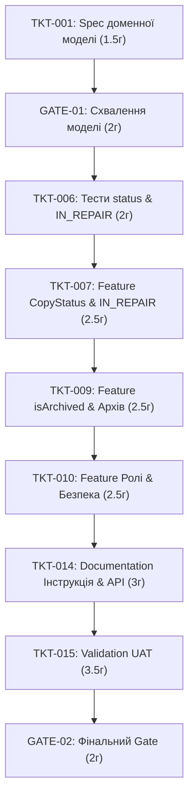

# Календарний план проєкту та графік залежностей

## 1. Загальний опис та методологія планомірного виконання

Цей документ містить календарно-мережевий план реалізації веб-системи «Онлайн-каталог локальної бібліотеки» на основі специфікації [srs.md](file:///c:/Users/User/source/repos/library-catalog/spec/srs.md).

Усі роботи розбиті за принципом TDD (Test-Driven Development): для кожного функціонального блоку спочатку створюються та узгоджуються автотести (`Test`), після чого виконується реалізація коду (`Feature`). Точки прийняття рішень та валідації (`Gate` / `Validation`) явно враховують людський фактор як потенційне «пляшкове горлечко».

---

## 2. Графік тікетів, залежності та оцінка часу

| ID тікета | Тип | Назва тікета | Реалізує вимогу | Жорсткі залежності (Blocked By) | Час AI (год) | Час Людина (год) | Загальна тривалість |
| :--- | :--- | :--- | :--- | :--- | :---: | :---: | :---: |
| **TKT-001** | `Specification` | Проєктування базової доменної моделі та структур даних | REQ-F-001..004 | Немає | 1.0 | 0.5 | 1.5 год |
| **GATE-01** | `Gate` | Схвалення базової доменної моделі та архітектури | REQ-F-001..004 | TKT-001 | 0.0 | 2.0 | 2.0 год |
| **TKT-002** | `Test` | Тести для пошуку книги (назва/автор, ISBN, жанри) | REQ-F-001 | GATE-01 | 1.5 | 0.5 | 2.0 год |
| **TKT-003** | `Feature` | Реалізація модуля пошуку та фільтрації книг | REQ-F-001 | TKT-002 | 2.0 | 0.5 | 2.5 год |
| **TKT-004** | `Test` | Юніт-тести обчислення `TitleAvailability` | REQ-F-002 | GATE-01 | 1.0 | 0.5 | 1.5 год |
| **TKT-005** | `Feature` | Реалізація `TitleAvailability` та детальної картки | REQ-F-002 | TKT-004, TKT-003 | 2.0 | 0.5 | 2.5 год |
| **TKT-006** | `Test` | Тести переходу статусів та блокування `IN_REPAIR` -> `RESERVED` | REQ-F-003, REQ-NF-002 | GATE-01 | 1.5 | 0.5 | 2.0 год |
| **TKT-007** | `Feature` | Логіка управління `CopyStatus` та блокування ремонтованих | REQ-F-003, REQ-NF-002 | TKT-006 | 2.0 | 0.5 | 2.5 год |
| **TKT-008** | `Test` | Тести архівування `isArchived` та приховування з пошуку | REQ-F-004 | GATE-01 | 1.5 | 0.5 | 2.0 год |
| **TKT-009** | `Feature` | Реалізація `isArchived` та розділу "Архів" | REQ-F-004 | TKT-008, TKT-007 | 2.0 | 0.5 | 2.5 год |
| **TKT-010** | `Feature` | Розмежування прав доступу (роль «Бібліотекар») | REQ-NF-003 | TKT-007, TKT-009 | 2.0 | 0.5 | 2.5 год |
| **TKT-011** | `Test` | Автоматизовані тести перевірки прав доступу | REQ-NF-003 | TKT-010 | 1.0 | 0.5 | 1.5 год |
| **TKT-012** | `Feature` | Візуальне розділення статусів в UI (кольорові індикатори) | REQ-NF-004 | TKT-005, TKT-009 | 2.5 | 0.5 | 3.0 год |
| **TKT-013** | `Verification` | Перевірка продуктивності пошуку (<500 мс на 50k) | REQ-NF-001 | TKT-003, TKT-005 | 1.5 | 0.5 | 2.0 год |
| **TKT-014** | `Documentation` | Підготовка інструкції користувача та опису API | REQ-F-001..004 | TKT-010, TKT-012 | 2.0 | 1.0 | 3.0 год |
| **TKT-015** | `Validation` | Приймальне тестування (UAT) та валідація SRS | Всі вимоги | TKT-011, TKT-012, TKT-013, TKT-014 | 0.5 | 3.0 | 3.5 год |
| **GATE-02** | `Gate` | Фінальне рішення про закриття релізу | Всі вимоги | TKT-015 | 0.0 | 2.0 | 2.0 год |

---

## 3. Критичний шлях (Critical Path)

**Критичний шлях** — це безперервний ланцюг послідовних задач, затримка в будь-якій з яких призведе до прямого зсуву дати фінального релізу проєкту.

### Ланцюг Критичного шляху:


### Обґрунтування Критичного шляху:
1. **`TKT-001` -> `GATE-01`**: Без схваленої людьми доменної моделі неможливо розпочати написання автотестів.
2. **`GATE-01` -> `TKT-006` -> `TKT-007`**: Управління статусами примірника (`IN_REPAIR`) формує базову цілісність даних (REQ-NF-002), на якій спираються наступні модулі.
3. **`TKT-007` -> `TKT-009`**: Архівування книги (`isArchived`) вимагає перевірки статусів усіх її примірників (повинні бути `LOST`), тому функціонал статусів є блокуючим для архівування.
4. **`TKT-009` -> `TKT-010`**: Права доступу бібліотекаря захищають критичні операції зміни статусів та архівування.
5. **`TKT-010` -> `TKT-014`**: Документація завершується після фіксації правил авторизації та бізнес-логіки.
6. **`TKT-014` -> `TKT-015` -> `GATE-02`**: Підсумкова валідація людиною та рішення Gate закривають проєкт.

**Загальна тривалість Критичного шляху:** **21.5 робочих годин** (~2.5 – 3 робочих дні з урахуванням часу реагування людини).

---

## 4. Текстова діаграма Ганта (Календарні фази)

```text
Фаза / Задача                          | ДЕНЬ 1       | ДЕНЬ 2       | ДЕНЬ 3       |
--------------------------------------------------------------------------------------
[TKT-001] Spec доменної моделі          | [===]        |              |              |
[GATE-01] Схвалення архітектури (Human)  |      [====]  |              |              |
[TKT-002] Test: Пошук & Фільтрація       |      [===]   |              |              |
[TKT-003] Feature: Пошук & Фільтрація    |             | [====]       |              |
[TKT-004] Test: TitleAvailability        |      [==]    |              |              |
[TKT-005] Feature: TitleAvailability     |             |      [====]  |              |
[TKT-006] Test: IN_REPAIR & Статуси      |             | [===]        |              |
[TKT-007] Feature: CopyStatus            |             |      [====]  |              |
[TKT-008] Test: isArchived               |             | [===]        |              |
[TKT-009] Feature: isArchived & Архів    |             |             | [====]       |
[TKT-010] Feature: Роль Бібліотекаря     |             |             | [====]       |
[TKT-011] Test: Авторизація              |             |             |      [==]    |
[TKT-012] Feature: UI індикація          |             |             | [====]       |
[TKT-013] Verification: Performance 500ms|             |             |      [==]    |
[TKT-014] Documentation: Документація    |             |             |      [====]  |
[TKT-015] Validation: UAT (Human)        |             |             |             | [======]
[GATE-02] Фінальний Gate (Human)         |             |             |             |       [====]
```
